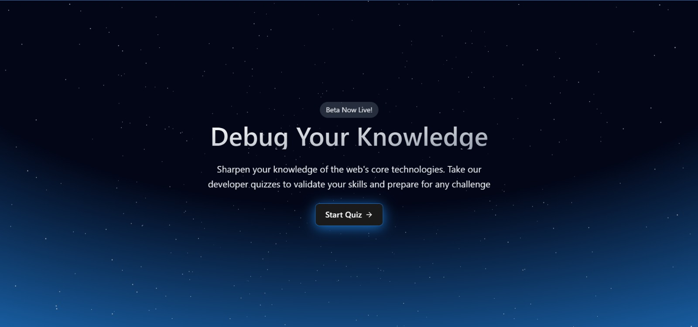
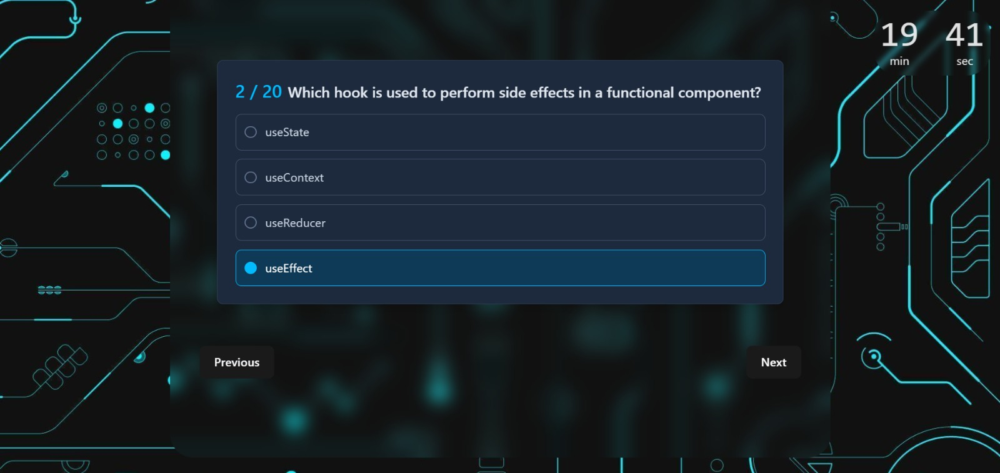
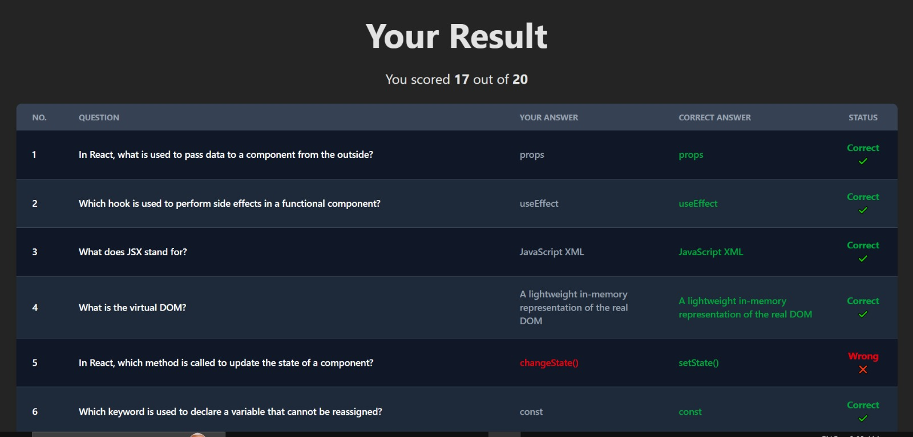

# Online Quiz Application

A full-stack web application where users can test their knowledge by taking a quiz, navigating through questions, and receiving their score upon completion. This project demonstrates a clean architecture with a React frontend and a Node.js/Express backend.


## Application Preview






## ✨ Features

**Core Functionality**

- **User-Friendly Interface** : A simple start page to begin the quiz smoothly.

- **Question Navigation** : Display questions one at a time with "Next" and "Previous" buttons for easy navigation.

- **State Management** : The frontend efficiently tracks user answers using React Context.

- **Secure API** : The backend serves questions without revealing the correct answers to the client.

- **Instant Scoring** : A dedicated backend endpoint calculates the user's score upon submission.

- **Results Display**: A final screen clearly displays the user's total score.

**Bonus Features**

- **Quiz Timer** : A frontend timer adds a challenging element to the quiz.

- **Detailed Results Page** : Shows the user exactly which questions they answered correctly and incorrectly.

- **Backend Testing** : Includes unit tests for the critical scoring logic to ensure reliability.


## Tech Stack

**Frontend:** React.js (Vite), TailwindCSS

**Backend:** Node.js, Express.js

**Database:** SQLite

**Testing:** Jest (for backend service tests)


## Project Structure

The repository is organized into two main parts: `frontend` and `backend`, with a logical and scalable folder structure.

```
QUIZ-APP/
├── .gitignore
├── backend/
│   ├── src/
│   │   ├── config/
│   │   ├── controller/
│   │   ├── models/
│   │   ├── routes/
│   │   ├── services/
│   │   └── tests/
│   ├── app.js
│   ├── server.js
│   ├── package.json
│   └── quiz.db
└── frontend/
    ├── src/
    │   ├── components/
    │   ├── context/
    │   ├── pages/
    │   └── services/
    ├── App.jsx
    ├── main.jsx
    ├── package.json
    └── vite.config.js
    
```
## Installation
To get a local copy up and running, please follow these steps.

**Prerequisites**

- Make sure you have the following installed on your machine:

- Node.js (v18.x or higher is recommended)

- npm (Node Package Manager)

- Git

 **Installation & Setup**
 1. **Clone the repository:**

```bash
git clone [https://github.com/Saswata777/Quiz-App.git](https://github.com/Saswata777/Quiz-App.git)
cd Quiz-App
```

2. **Run the Frontend:**
```bash
cd frontend
npm install
npm run dev
```
The frontend development server will start, typically on `http://localhost:5173`.

3. **Run the Backend:** Open a new terminal window in the Quiz-App directory.

```bash
cd backend
npm install
npm run dev
```
The backend API server will start, typically on `http://localhost:5000`.

The application is now fully running and you can access it from your browser at the frontend URL.


    
##  API Endpoints

The backend provides the following endpoints to support the quiz flow:

| Method | Endpoint           | Description                                                                    |
|--------|--------------------|--------------------------------------------------------------------------------|
| `GET`  | `/api/quiz/questions`        | Fetches all questions for the quiz. Correct answers are not included in the response. |
| `POST` | `/api/quiz/submit` | Takes the user's answers, calculates the score, and returns the result.        |

## 👋 Contributing

Contributions are welcome! If you have suggestions for improvements, please fork the repository and create a pull request, or open an issue with the "enhancement" tag.

1. Fork the Project
2. Create your Feature Branch (`git checkout -b feature/NewFeature`)
3. Commit your Changes (`git commit -m 'Add some NewFeature'`)
4. Push to the Branch (`git push origin feature/NewFeature`)
5. Open a Pull Request
## License

Distributed under the [MIT](https://choosealicense.com/licenses/mit/) License. See LICENSE file for more information


